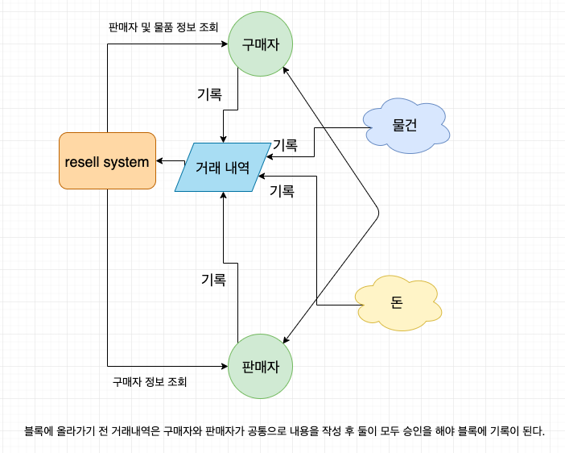

# resell-market system

## 현재 문제점
- 중고 거래 시 구입자 입장에서 구매하려는 물건이 과거에 거래 된 적이 있었는지에 대한 정보가 없다.
- 사기 이력에 대해선 검색할 수 있는 어플 및 사이트가 있으나 최근 6개월 기간만 적용이 되므로, 그 이전에 대한 정보는 알아 낼 수 없다.

## 해결 방안
- 판매자의 사기 이력에 대해선, 블록에 저장되므로 소멸되지가 않는다.
- 물품의 거래내역 또한 블록에 저장되므로 구매자가 직접 찾아볼 수 있다.

## 토큰 이코노미

